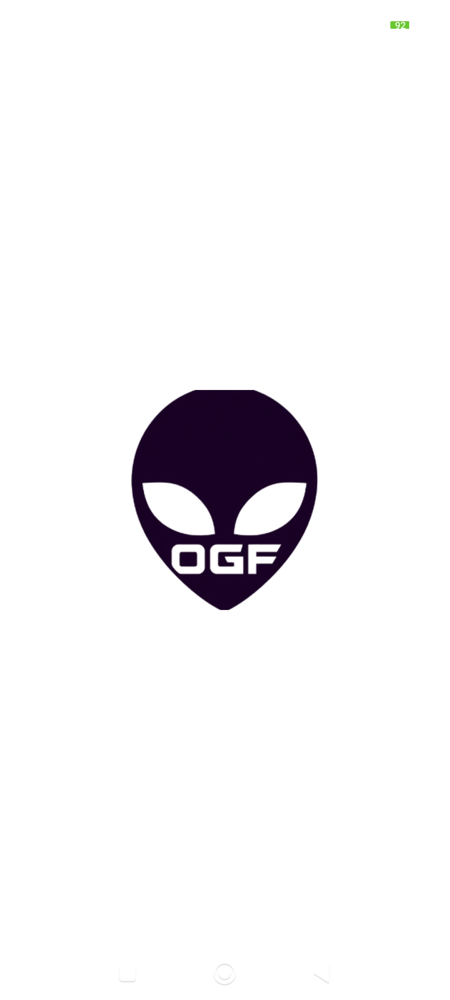
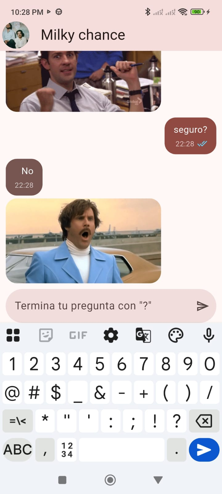

# Práctica 03 · Yes No App 👽

## Descripción

**Yes No App** es una aplicación de chat en Flutter. Cuando el usuario envía una pregunta que termina en `?`, **Milky chance** responde **Sí**, **No** o **Tal vez**. La elección se realiza con una distribución de **40 % Sí, 40 % No y 20 % Tal vez**. La app consulta [yesno.wtf](https://yesno.wtf/) para mostrar un GIF correspondiente a la respuesta.

## Objetivos de la práctica

- Crear un ícono personalizado que se muestre al abrir la aplicación.
- Implementar las respuestas con una distribución de **40 % Sí, 40 % No y 20 % Tal vez**, junto con su GIF.
- Mostrar la hora de envío en cada mensaje con burbujas de chat de estilo WhatsApp.

## Funcionalidades

- Permite escribir y mostrar mensajes con su hora.
- Responde automáticamente cuando el mensaje termina en `?`. La elección local es **40 % Sí, 40 % No y 20 % Tal vez**.
- Consulta la API de `yesno.wtf` para mostrar un GIF acorde con la respuesta. Si no hay imagen, mantiene la respuesta de texto.
- Muestra palomitas de enviado, entregado y visto. Estos estados se **simulan dentro de la aplicación**.

## Evidencias

Las capturas muestran el ícono inicial, las burbujas con hora y ejemplos de las tres respuestas. Los ejemplos ilustran los resultados posibles; la distribución 40/40/20 corresponde a la lógica de selección de respuestas.

### Ícono personalizado al iniciar

### Chat y hora de envío

### Respuesta Sí con GIF

### Respuesta No con GIF

### Respuesta Tal vez con GIF

## Tecnologías utilizadas

| Tecnología | Función en la práctica |
| --- | --- |
|  | Construcción de la aplicación multiplataforma. |
|  | Lenguaje de programación de la app. |
|  | Gestión del estado y la lista de mensajes. |
|  | Peticiones HTTP a la API externa. |
|  | Servicio que proporciona el GIF de la respuesta. |
|  | Generación de la arquitectura interactiva. |
|  | Publicación del diagrama HTML. |

## Arquitectura interactiva

**[Ver la arquitectura de la práctica 03 en GitHub Pages](https://obedguzmanguz.github.io/Practicas_DMI_230142/Practica03/yes_no_app/arquitectura/arquitectura_yes_no_app.html)**

El diagrama explica el flujo del chat, sus componentes y las plataformas Android, iOS, Web, Windows, Linux y macOS. Al seleccionar un bloque se abre su descripción y el enlace al archivo correspondiente en GitHub.

También puedes consultar el [archivo HTML de la arquitectura](arquitectura/arquitectura_yes_no_app.html) dentro del proyecto y abrirlo con doble clic en tu navegador. No necesitas ejecutar Flutter para visualizarlo.
