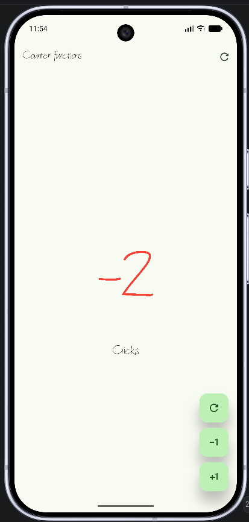
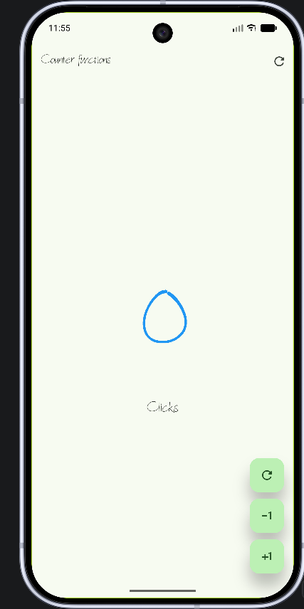
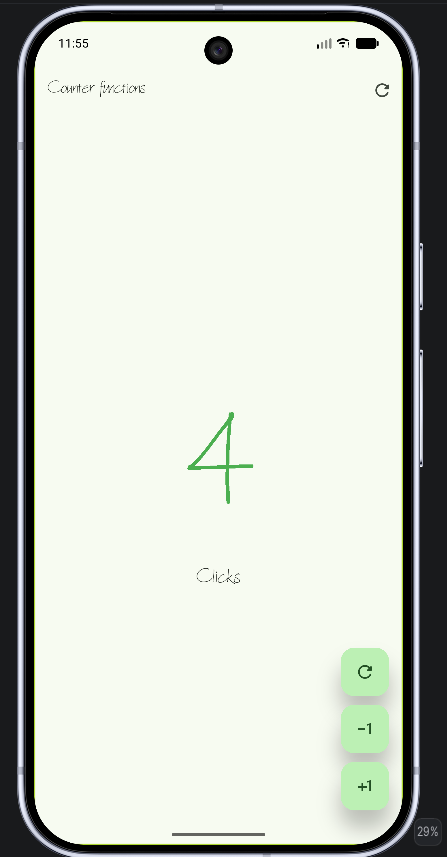

# Práctica: Contador con funciones, colores y tipografía personalizada en Flutter

## Descripción

Esta práctica consiste en una aplicación desarrollada con **Flutter y Dart** que permite manipular un contador mediante botones para **incrementar, disminuir y reiniciar** su valor.  
También se agregaron cambios visuales para identificar fácilmente si el número mostrado es positivo, negativo o cero.

## Objetivo

Aplicar el manejo de estado en Flutter mediante `StatefulWidget` y `setState()`, además de personalizar la interfaz utilizando colores condicionales, botones reutilizables y una tipografía personalizada.

## ¿Qué se realizó?

- Se implementó un contador iniciado en `0`.
- Se agregó un botón **+1** para incrementar el contador.
- Se agregó un botón **-1** para disminuir el contador.
- Se agregó la opción de **reiniciar el contador a 0**.
- Se configuró el color del número según su valor:
  - **Verde:** número positivo.
  - **Rojo:** número negativo.
  - **Azul:** valor igual a cero.
- Se utilizó `setState()` para actualizar la interfaz cada vez que cambia el contador.
- Se creó el widget reutilizable `CustomButton` para los botones flotantes.
- Se configuró el texto `Click` / `Clicks` dependiendo del valor del contador.
- Se agregó la tipografía personalizada **Architext** mediante `pubspec.yaml`.
- Se aplicó un tema basado en color verde con `ThemeData`.

## Archivos principales modificados

- `lib/main.dart`  
  Configuración principal de la aplicación, tema, fuente Architext y pantalla inicial.

- `lib/presentation/screens/counter/counter_functions_screen.dart`  
  Contiene la lógica del contador, botones, colores condicionales y actualización del estado.

- `pubspec.yaml`  
  Registro de la tipografía personalizada utilizada en la aplicación.

## Evidencias

### 1. Contador con valor negativo

El valor se muestra en **rojo** cuando el contador es menor que cero.

### 2. Contador en cero

Cuando el contador tiene un valor de `0`, se muestra en **azul**.

### 3. Contador con valor positivo

El valor se muestra en **verde** cuando el contador es mayor que cero.

## Arquitectura

La arquitectura representa la estructura y el funcionamiento principal de la aplicación Flutter.  
Fue generada con **Archify** a partir de los componentes reales del proyecto.

### Arquitectura interactiva

[Ver arquitectura interactiva](arquitectura/arquitectura_contador_flutter.html)

## Tecnologías utilizadas

- Flutter
- Dart
- Material Design
- Architext
- Archify

## Resultado

La aplicación permite modificar el contador correctamente y muestra de forma visual su estado mediante colores y una tipografía personalizada, cumpliendo con los requisitos establecidos para la práctica.
